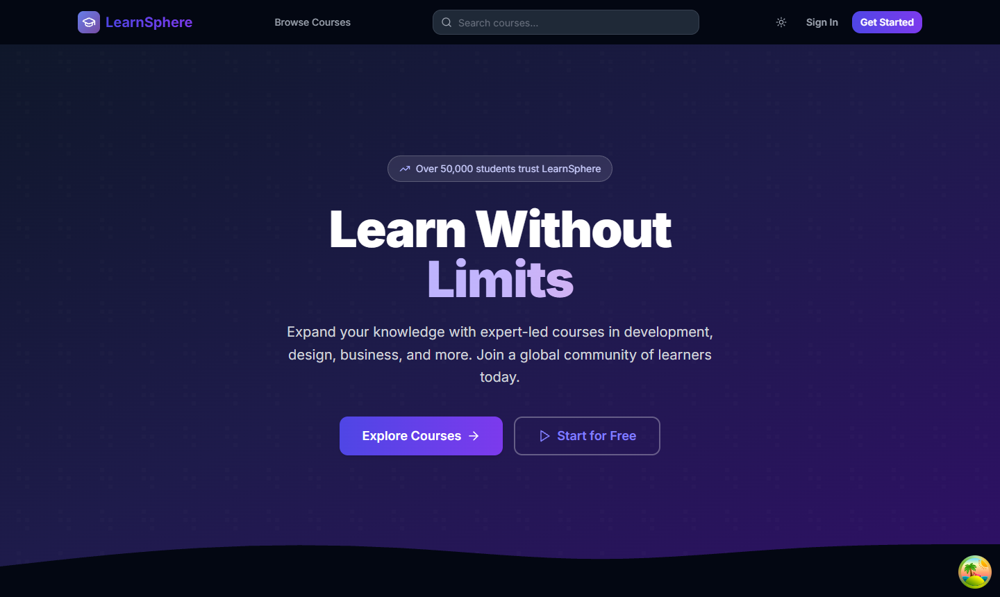
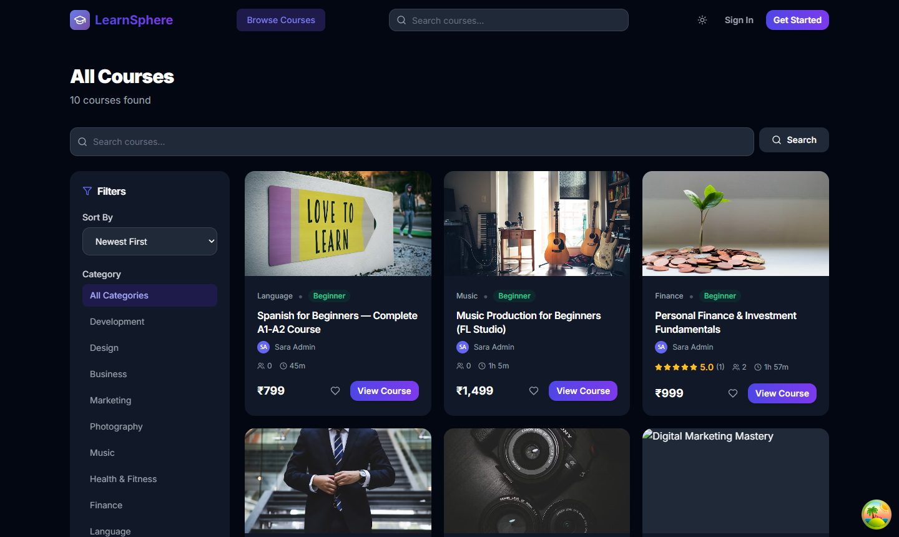
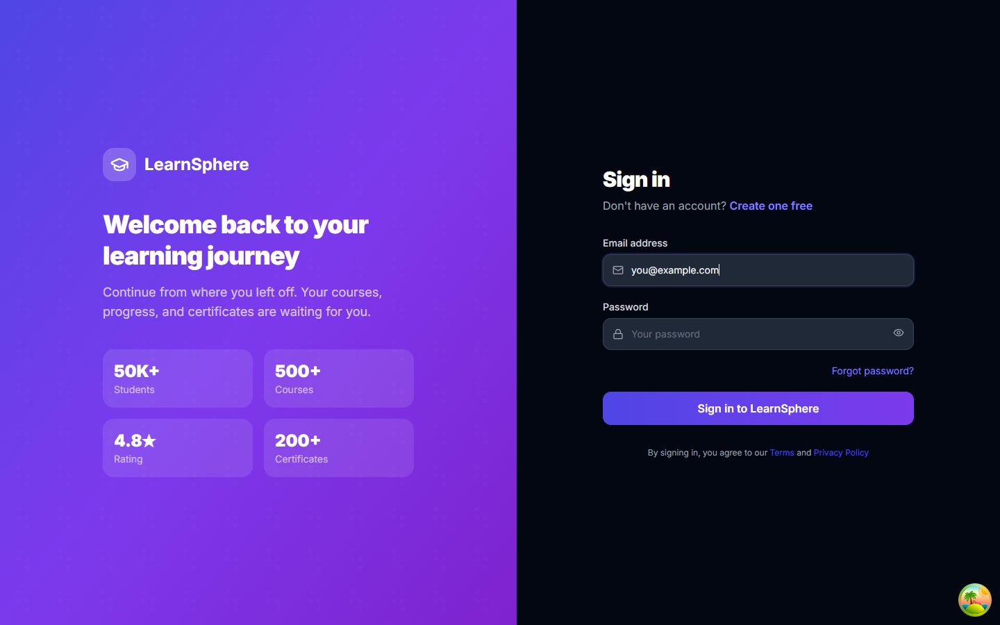
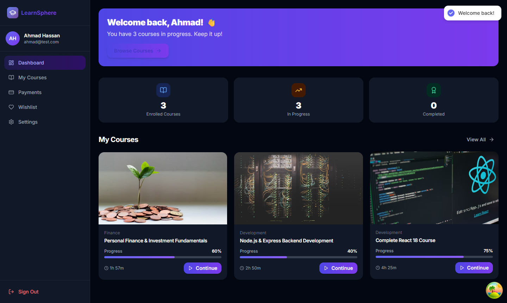
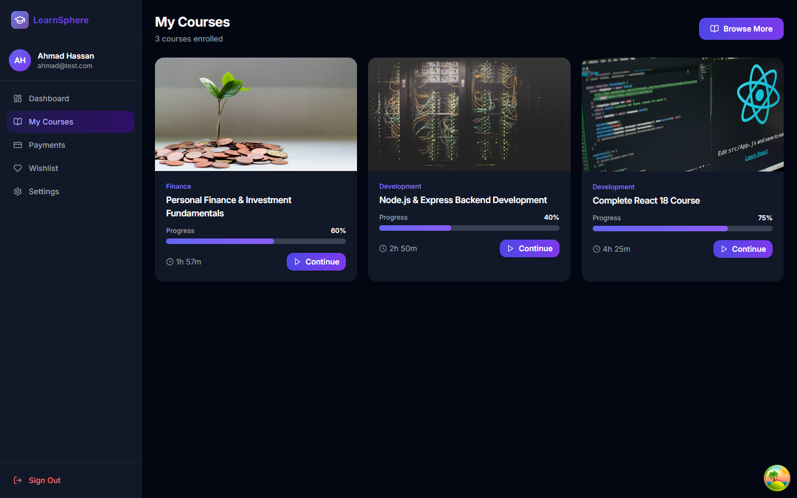
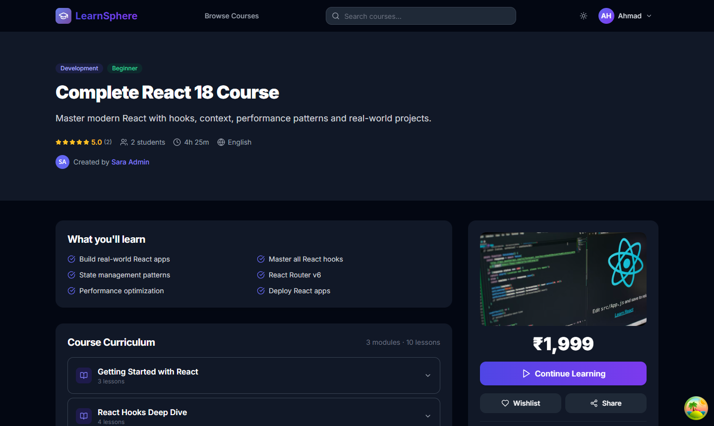
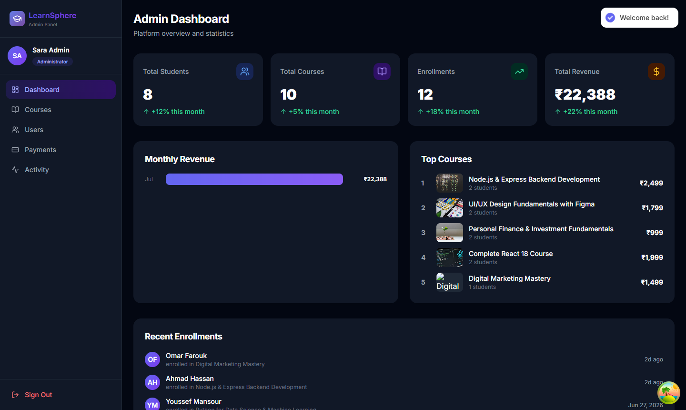
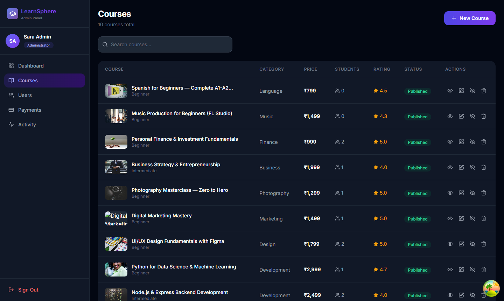
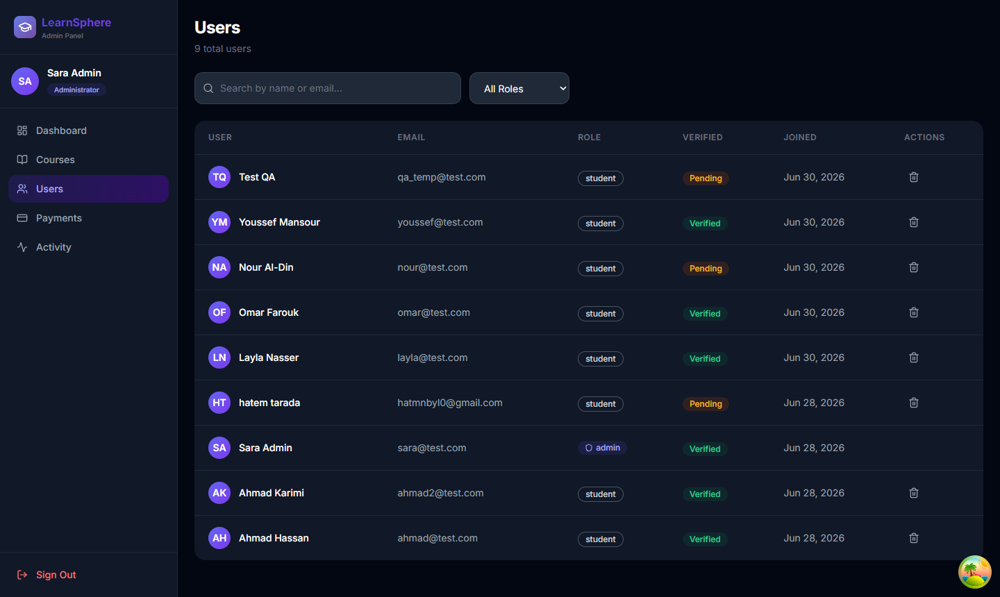
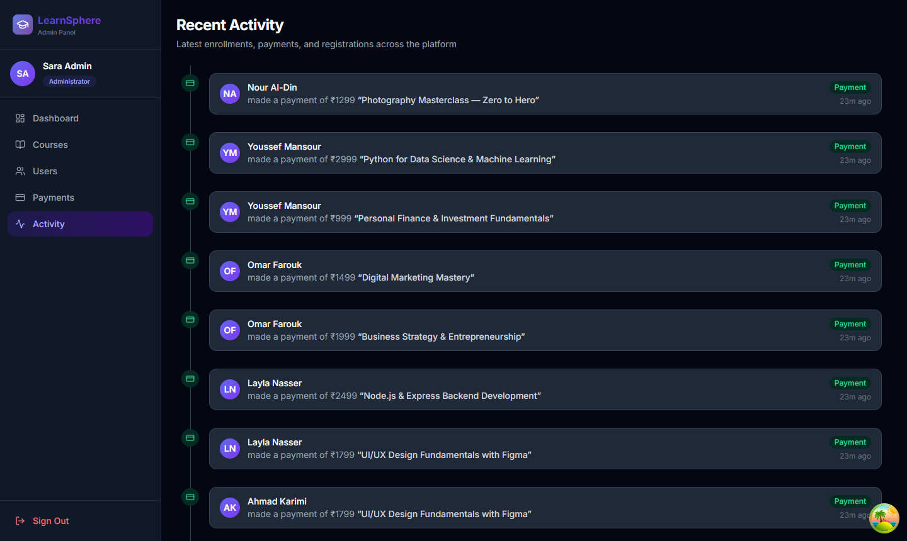

# LearnSphere — Full Stack Online Course Platform

A production-ready online learning platform inspired by Udemy and Coursera, built with the MERN stack and modern web technologies.



---

## Screenshots

| | |
|---|---|
|  |  |
| **Home Page** | **Browse Courses** |
|  |  |
| **Login Page** | **Student Dashboard** |
|  |  |
| **My Courses** | **Course Detail** |
|  |  |
| **Admin Dashboard** | **Admin — Manage Courses** |
|  |  |
| **Admin — Users** | **Admin — Activity Feed** |

---

## Features

### Student Features
- Browse and search courses by category, level, and rating
- Enroll in courses via Razorpay payment gateway (or free enrollment for $0 courses)
- Watch video lessons and track progress lesson by lesson
- Resume last lesson automatically
- Wishlist courses for later
- Leave reviews and ratings
- Account settings and profile management

### Admin Features
- Dashboard with live statistics (revenue, users, enrollments)
- Create, edit, publish, and delete courses
- Manage modules and lessons inside each course
- View and manage all users (search, filter, delete)
- View all payment transactions
- Real-time activity feed (enrollments, payments, registrations)

### Platform Features
- JWT authentication with auto-refresh tokens
- Role-based access control (Student / Admin)
- Dark mode support across all pages
- Fully responsive (mobile, tablet, desktop)
- Loading skeletons and error states
- Rate limiting and security hardening

---

## Tech Stack

### Frontend
| Technology | Purpose |
|---|---|
| React 18 + Vite | UI framework and build tool |
| TypeScript | Type safety |
| TailwindCSS | Styling |
| React Router DOM v6 | Client-side routing |
| TanStack Query | Server state management and caching |
| Axios | HTTP client with interceptors |
| React Hook Form + Zod | Form validation |
| Framer Motion | Animations and transitions |
| React Hot Toast | Notifications |
| Lucide Icons | Icon library |

### Backend
| Technology | Purpose |
|---|---|
| Node.js + Express.js | Server and REST API |
| TypeScript | Type safety |
| MongoDB + Mongoose | Database and ODM |
| JWT (Access + Refresh) | Authentication |
| bcryptjs | Password hashing |
| Razorpay | Payment gateway |
| Helmet | HTTP security headers |
| express-rate-limit | Rate limiting |

---

## Getting Started

### Prerequisites
- Node.js >= 18.0.0
- MongoDB >= 6.0 (local or Atlas)
- Razorpay Test Account

### Backend Setup

```bash
cd backend
npm install
cp .env.example .env
# Fill in your .env values
npm run dev
```

### Frontend Setup

```bash
cd frontend
npm install
cp .env.example .env
# Fill in VITE_API_URL and VITE_RAZORPAY_KEY_ID
npm run dev
```

### Seed Demo Data

```bash
cd backend
node seed.js
```

This creates 7 users, 10 courses, 19 modules, 60 lessons, 12 enrollments, 9 reviews, and 12 payments.

**Demo accounts:**
| Role | Email | Password |
|---|---|---|
| Admin | sara@test.com | Admin@1234 |
| Student | ahmad@test.com | Test@1234 |
| Student | layla@test.com | Test@1234 |

---

## Environment Variables

### Backend `.env`
```env
NODE_ENV=development
PORT=5000
MONGODB_URI=mongodb://localhost:27017/learnsphere
JWT_SECRET=your_jwt_secret
JWT_EXPIRES_IN=15m
JWT_REFRESH_SECRET=your_refresh_secret
JWT_REFRESH_EXPIRES_IN=7d
RAZORPAY_KEY_ID=rzp_test_xxxxxxxxxx
RAZORPAY_KEY_SECRET=xxxxxxxxxxxxxxxxxxxxxxxx
CLIENT_URL=http://localhost:5173
```

### Frontend `.env`
```env
VITE_API_URL=http://localhost:5000/api
VITE_RAZORPAY_KEY_ID=rzp_test_xxxxxxxxxx
```

---

## Project Structure

```
LearnSphere/
├── backend/
│   ├── src/
│   │   ├── config/          # DB and environment config
│   │   ├── controllers/     # Request handlers
│   │   ├── middlewares/     # Auth, error, rate-limit
│   │   ├── models/          # Mongoose schemas
│   │   ├── routes/          # Express routers
│   │   ├── utils/           # Helpers and error classes
│   │   └── app.ts           # Express app setup
│   ├── seed.js              # Demo data seed script
│   └── tsconfig.json
│
├── frontend/
│   ├── src/
│   │   ├── components/      # Reusable UI components
│   │   ├── context/         # React Auth context
│   │   ├── pages/           # Route page components
│   │   │   ├── admin/       # Admin panel pages
│   │   │   ├── auth/        # Login and Register
│   │   │   ├── courses/     # Course listing and detail
│   │   │   └── dashboard/   # Student dashboard and learning
│   │   ├── services/        # Axios API service layer
│   │   ├── types/           # TypeScript type definitions
│   │   └── utils/           # Utility functions
│   └── vite.config.ts
│
└── screenshots/             # Application screenshots
```

---

## API Overview

### Auth
| Method | Endpoint | Description |
|---|---|---|
| POST | `/api/auth/register` | Register new user |
| POST | `/api/auth/login` | Login |
| POST | `/api/auth/logout` | Logout |
| POST | `/api/auth/refresh-token` | Refresh access token |
| GET | `/api/auth/me` | Get current user |

### Courses
| Method | Endpoint | Description |
|---|---|---|
| GET | `/api/courses` | List courses (filter, search, paginate) |
| GET | `/api/courses/:id` | Course detail with curriculum and reviews |
| POST | `/api/courses` | Create course (admin) |
| PUT | `/api/courses/:id` | Update course (admin) |
| DELETE | `/api/courses/:id` | Delete course (admin) |

### Enrollments & Payments
| Method | Endpoint | Description |
|---|---|---|
| POST | `/api/enrollments/free/:courseId` | Enroll in free course |
| POST | `/api/payments/create-order` | Create Razorpay order |
| POST | `/api/payments/verify` | Verify payment and enroll |
| GET | `/api/enrollments/my` | Get my enrollments |
| POST | `/api/lessons/:id/complete` | Mark lesson as complete |

### Admin
| Method | Endpoint | Description |
|---|---|---|
| GET | `/api/admin/stats` | Dashboard statistics |
| GET | `/api/admin/users` | List and search users |
| GET | `/api/admin/activity` | Recent platform activity |

---

## Database Schema

```
User  ──creates──►  Course  ──contains──►  Module  ──contains──►  Lesson
  │                   │
  └──enrolls──►  Enrollment  ◄── tracks completed Lessons
  │                   │
  └──pays──►  Payment       
  │
  └──reviews──►  Review  ──about──►  Course
```

---

## Deployment

### Backend — Railway / Render
1. Push to GitHub → connect repo
2. Set all environment variables
3. Auto-deploy on push

### Frontend — Vercel / Netlify
1. Push to GitHub → connect repo
2. Set `VITE_API_URL` to deployed backend URL
3. Set `VITE_RAZORPAY_KEY_ID`
4. Deploy

### Database — MongoDB Atlas
1. Create free cluster at atlas.mongodb.com
2. Whitelist `0.0.0.0/0`
3. Copy connection string → set as `MONGODB_URI`

---

## License

MIT License
